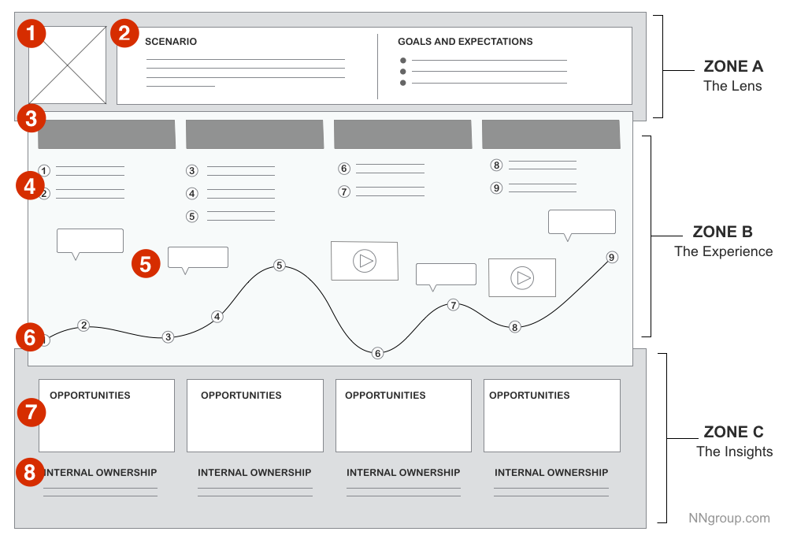
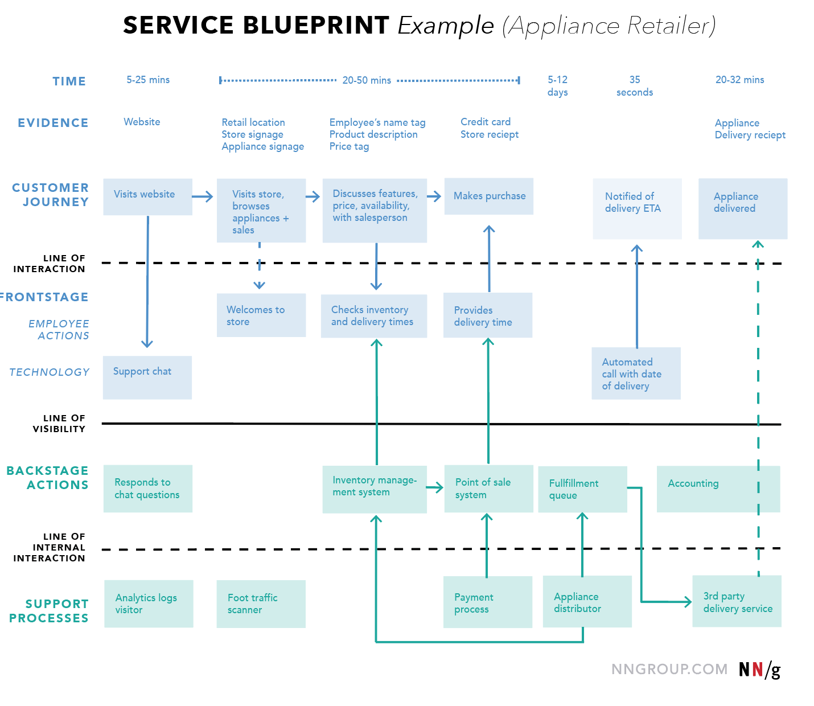
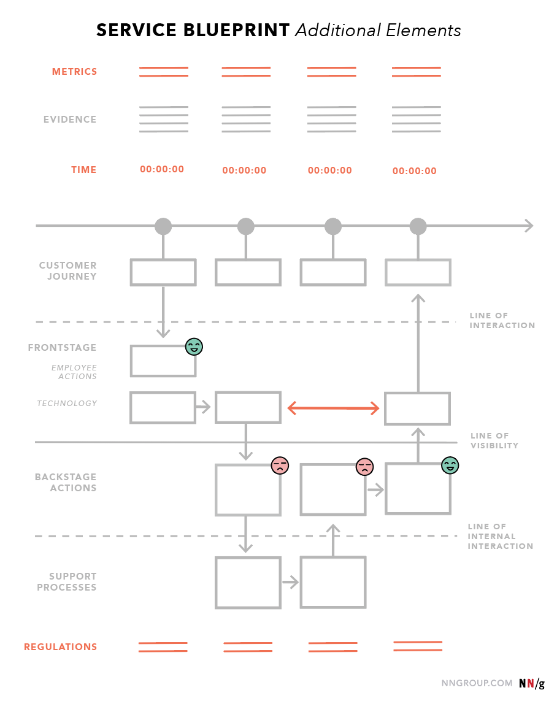

# Service Design

Service design is the activity of planning and organizing a business’s resources (people, props, and processes) in order to directly improve the employee’s experience, and indirectly, the customer’s experience.

Services are instantaneous exchanges that are intangible and do not result in ownership.

## Components of _Service Design_

The three main components of service design are:

### People

This component includes anyone who creates or uses the service:

- Employees

- Customers

- Fellow customers encountered throughout the service

- Partners

### Props

Refers to the physical or digital artifacts (including products) that are needed to perform the service successfully:

- Physical space: storefront, conference room

- Digital environment through which the service is delivered (Webpages, Blogs, Social Media)

- Objects (Digital files, Physical products)

### Processes

These are any workflows, procedures, or rituals performed by either the employee or the user throughout a service:

- Getting an issue resolved over support

- Interviewing a new employee

- Sharing a file

### Frontstage vs. Backstage

Service components are broken down into frontstage and backstage, depending on whether the customers sees them or not.

Frontstage components:

- Channels

- Touchpoints

- Products

- Interfaces

Backstage components:

- Policies

- Technology

- Infrastructures

- Systems

## Benefits of Service Design

Most resources (time, budget, logistics) are spent on customer-facing outputs, while internal processes (including the experience of the organization’s employees) are overlooked.

- Surfacing conflicts - triggers thought and provides context around systems that need to be in place in order to adequately provide a service throughout the entire product’s life cycle

- Fostering hard conversations - expose weak links and misalignment and enable organizations to devise collaborative and crossfunctional solutions

- Reducing redundancies

- Forming relationships

## Customer Journey Mapping

Focus on a specific customer’s interaction with a product or service.

A visualization of the process that a person goes through in order to accomplish a goal tied to a specific service or product.

In its most basic form, journey mapping starts by compiling a series of user goals and actions into a timeline skeleton. Next, the skeleton is fleshed out with user thoughts and emotions in order to create a narrative.

There is one map per persona / user type (1:1 mapping). It is a must to create a customer persona.

### Benefits of Customer Journey Mapping

- Shift a company’s perspective from inside-out to outside-in

- Pinpointing of specific customer journey touchpoints that cause pain or delight

- Break down silos to create one shared, organization-wide understanding of the customer journey

- Assign ownership of key touchpoints in the journey to internal departments

- Target specific customers

- Understand quantitative data

### Key Elements of a Customer Journey Map

- **Zone A**: The lens provides constraints for the map

  - (1) Persona / actor (_who_) as point of view.

  - (2) Scenario (_what_) an existing journey, where mapping will uncover positive and negative moments, or a _to-be_ experience for a product or service that doesn’t exist yet. Clarify the user’s goal during this experience.

- **Zone B**: The heart of the map is the visualized experience

  - (3) Chunkable phases of the journey.

  - (4) Actions are the behaviors and steps taken by users. Add _touchpoints_ here. A touchpoint represents a specific interaction between a customer and an organization. It includes the device being used, the channel used for the interaction, and the specific task being completed.

  - (5) Thoughts correspond to users’ questions, motivations, and information needs.

  - (6) Emotions signaling the emotional _ups_ and _downs_ of the experience.

- **Zone C**: The output should vary based on the business goal the map supports, but it could describe the insights and pain points discovered

  - (7) Opportunities to focus on going forward.

  - (8) Internal ownership.

### 5 Steps of Successful Customer Journey Mapping

Customer journey mapping follows five key high-level steps:

1. Aspiration and allies:

- Define the scope and goal

- Educate and engage stakeholders

2. Internal investigation:

- Gather existing research (Market-research surveys, Brand audits, Call-center or customer-support logs, Site surveys or VOC (voice of customer) feedback, Outputs from client advisory board (CAB) meetings)

- Perform internal stakeholder interviews (Sales-team members, Marketing-team members, Management Support-team members (e.g., technical-support representatives), R&D team members or product owners)

3. Assumption formulation:

- Synthesize internal insights

- Create a draft framework / hypothesis map

4. External research:

- Use the draft framework to shape external research

- Perform qualitive, primary research (Customer interviews, Direct observation, Contextual inquiry, Diary studies)

5. Narrative visualization:

- Collectively map out a visual narrative that shares the story of your research

- Use it to drive change

## Service Blueprinting

Service blueprints map out the relationship between various service components (people, processes, and props) and customer journey touchpoints.

Service blueprints are counterparts to customer journey maps, with more focus on the employees.

### Benefits of Service Blueprinting

1. Shared language and understanding: _one document to rule them all_

2. Forced holistic thinking: Make invisible service components visible and help put products in context. Refocusing on the big picture, instead of products or departments as silos.

3. Informed project planning: Visualize service dependencies and gaps. Organizations can identify broken processes and areas of improvement to prioritize projects on an organization’s roadmap.

### Key Elements of a Service Blueprint

An example blueprint for an appliance retailer

Every service blueprint comprises some key elements:

- Customer actions (derived from research or a customer-journey map)

- Frontstage actions (directly linked to customer’s actions)

- Backstage actions

- Processes (internal steps, and interactions that support the employees in delivering the service)

Key elements are organized into clusters with lines that separate them:

- **Line of interaction** depicts the direct interactions between the customer and the organization.

- **Line of visibility** separates all service activities that are visible (frontstage appears above) to the customer from those that are not visible (backstage appears below).

- **Line of internal interaction** separates contact employees from those who do not directly support interactions with customers/users.

The last layer of a service blueprint is evidence, which is made of the props and places that anyone in the blueprint has an exchange with.

Secondary elements are:

- Time

- Regulations or Policy (understand what can and cannot be changed as we optimize)

- Emotion (Where are employees frustrated? Where are employees happy and motivated?)

- Metrics (Any success metric that can provide context to your blueprint is a benefit. An example may be the time spent on various processes, or the financial costs associated with them. These numbers will help the business identify where time or money are wasted due to miscommunication or other inefficiencies.)

### Service Blueprinting Workshops

#### Before the Workshop

- Establish a Core Team and Workshop Goals

- Collect and Synthesize Research: internal research (employee surveys, customer-support tickets) and external customer data, Customer Journey Map,

- Create an Agenda with Timing

- Select Workshop Tools and Materials

- Set Roles and Responsibilities (parking lot manager, notetaker and timekeeper, that can be delegated to workshop attendees to get more buy in)

#### During the Workshop

- Introductions and Icebreakers

- Research Overview: time during the workshop for participants to review the underlying research

- Blueprint Key Elements: documenting customer actions, frontstage, backstage, and support processes

- Track Questions and Assign Action Items: document questions that will inevitably come up, schedule a followup meeting with the owner

- Playback: How did it go? What did they learn? Did anything surprise them? What open questions do they have?

- Prioritize and Discuss Fail Points

#### After the Workshop

- Follow Up on Action Items: work on answering your questions, and progress in your blueprinting efforts

- Layer in Quantitative Data: mostly employee pain points

- Clean up and Share the Blueprint:

## References

- https://www.nngroup.com/articles/service-design-101/

- https://www.nngroup.com/articles/service-blueprinting-practice/

- https://www.nngroup.com/articles/service-blueprints-definition/

- https://www.nngroup.com/articles/service-blueprinting-workshops/

- https://www.nngroup.com/articles/customer-journey-mapping-process/

- https://www.nngroup.com/articles/customer-journey-mapping/
