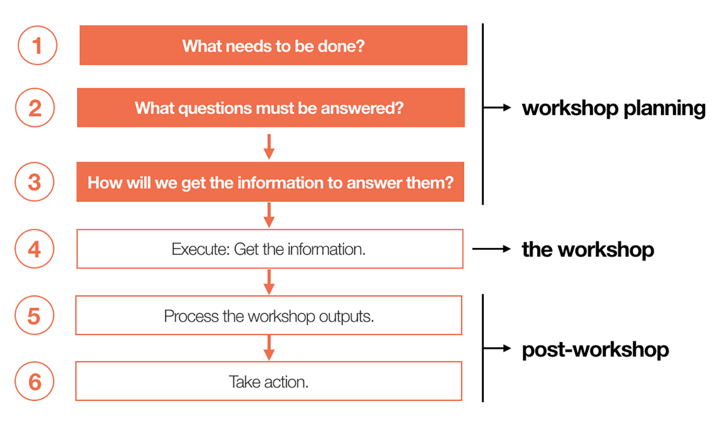

# Workshop Planning

To collect knowledge and generate new ideas, it’s best to bring people together. But even when people come together with the best intentions, ideas and outputs don’t just simply happen.

One must design the flow of the workshop and plan collaborative exercises that will lead attendees toward a common goal.

Workshop facilitators may often find that, even when carefully planned workshop agendas divert in real-time because of new information, the time spent planning is still crucial for effective facilitation.

This article outlines a systematic, modular approach to building workshop agendas that ensures that time spent in the workshop will be valuable and that actionable results will be produced.

There are three building blocks of effective workshop agendas:

- Goal: The desired outcome or end result of a workshop

- Questions: The information that the organizer needs to gather in order to reach the stated goal

- Processes: The activities the attendees will do in order to gather the required information

There is a precise approach, outlined below, that helps to integrate these three building blocks into a focused and goal-based agenda.

## 1. Articulate the goal(s)

Start planning by beginning with a clear goal statement.

Consider what the tangible output is and write a short, clear description of the ideal end state.

End states fall into one or more common categories, such as:

- Agreement: Consensus on direction

- Understanding: Shared deeper knowledge of a subject

- Generation: Creation of new ideas or thought patterns

- Strengthening: Building empathy between teams or strengthening relationships between parties

## 2. Document what information you need in the form of questions

Typically, there is a gap between your current state and the goal state you have just articulated.

Ask yourself, _What questions must be answered in order for me to move toward my end-state goal?_ and document those questions.

Once documented, likely there will be themes within these questions that can be grouped into segments; these segments will start to create a structure for the workshop.

## 3. Align processes to groups of questions

Select workshop activities or discussions that align to each theme that emerged within the questions. Reflect on what types of processes will help the group to move toward answering the specific questions.

Examples:

- If you need to help a group move toward consensus, you might choose a forced ranking or prioritization exercise, like dot voting.

- If you need to generate new ideas quickly, you might choose a brainwriting activity, a post-it notes exercise, or some other form of brainstorming.

- If you simply need to understand what research is available across the organization, you might have different groups do short readouts of pertinent findings.

Before creating an agenda, answer the questions below.

- Workshop Goal: What are we trying to achieve? Why is a workshop appropriate for achieving this goal?

- Ownership: Which parties are responsible for planning, facilitating and executing the workshop?

- Timing: When will the workshop roughly take place? Are there any dependencies for the workshop?

- Questions to Answer: What questions are you hoping to answer in the workshop? What decisions need to be made?

- Attendees: Who needs to attend the workshop? Who has knowledge that will help answer the above questions, and who has authority to make the necessary decisions?

- Environment: Where should the workshop be held? What kind of environment will set the appropriate tone?

- Key Takeaways: What should we have at the end of the workshop (e.g., a decision or output)?

- Definition of Success: How will we determine the success of the workshop?

After you’ve created a focused agenda - you will need to develop timelines for each segment, gather material needed to capture discussions and facilitate the activities.

## 4. Conduct the workshop

The previous steps of planning will adequately prepare you to guide the discussion, and understand if unplanned discussions that pop up are off-topic or meaningful tangents.

Go through a series of **diverge-and-converge sequences**.

The diverge-and-converge collaboration method has two stages: (1) a diverge stage, during which team members work independently to produce individual insights and (2) a converge stage, where they discuss the results of the diverge phase as a group in order to decide on some collective output.

Depending on the goal of the activity, the diverge part can happen before the workshop, with participants working by themselves at their own pace, or during the workshop, with all participants spending a dedicated period of time to do the individual work in parallel.

Diverging first enables team members to:

- Focus on the task at hand without distractions

- Quickly gather data or organize information

- Tackle multiple parts of a project

- Interpret or analyze information at their own pace

- Generate creative ideas in a safe space

- Counteract groupthink (i.e., being influenced by others’ ideas)

Converging afterward enables teams to:

- Identify patterns and uncover new perspectives

- Frame problems differently

- Align and build a shared understanding of the problem to be solved

- Create strong team relationships for future collaborative efforts

- Build empathy among team members

- Increase the odds of solving the problem or finding objective truth

The most important piece of running diverge-and-converge exercises is to set expectations and ground rules before running these activities. Doing this early can help ease tension between group members, increase contributions, and avoid groupthink:

- Enforce divergent and convergent time as _quiet_ and _talking_ time

- Ban the words _no_ or _but_ - people often become defensive and reluctant to share when they hear others openly rejecting their ideas or contributions with words like _no_ or _but_

It does cost a little more time to employ two steps instead of proceeding directly to the solution, but the ROI usually makes it worthwhile.

Diverge-and-converge activities are most useful during collaborative efforts which are subject to skewed results due to personal bias, groupthink, or the HiPPO effect (highest paid person’s opinion). Some common use cases:

- Collecting and Analyzing Research Findings

- Mapping Workshops - customer-journey maps, experience maps, service blueprints, ...

- Design-Thinking Workshops

## 5. Process the information

When the workshop is over, analyze the information collected during the group activities and discussions. Analyze these outputs and share artifacts with attendees and other key stakeholders.

## 6. Act

Use the results produced and the information gathered in your workshop in order to move the needle on your overall goal.

## Workshops vs. Meetings: What's the Difference?

### Purpose

**Meetings are for sharing information; workshops are for solving a problem or reaching an actionable goal.**

Simply put, meetings are where things get discussed. Workshops are where things get done.

Differences between meetings and workshops are defined by factors such as:

- Purpose and scope

- Typical session length

- Internal cost to produce

- Cost to clients (if working at an agency, consultancy, or as a freelancer)

- Materials required

- Roles required

- Preparation required

- Post-session activities required

It’s a useful activity to sit down with relevant team members and show them the differences between meetings and workshops.

To develop a shared understanding that prevents people from calling for workshops without fully understanding the level of commitment that effective workshops require.

#### When Should I Have a Meeting?

- Project kickoff: An initial gathering of team members, where key information such as project briefs and roles are discussed

- Standup: A quick daily, literal standup of a team to share updates on progress and obstacles across workstreams

- Retrospective: A regular discussion where teams reflect on how they work together and consider ways to improve their processes

- One-on-one: Dedicated time for leads or managers to meet with a direct report to discuss projects, personal growth, and development opportunities

- Leadership sync: Leads over several subteams gathering to discuss progress, learnings, and outstanding action items

- Team-specific meeting: Developer, UX, sales, or design team members coming together to share work, knowledge and inspiration

- Review: Team members presenting progress and receiving feedback on a topic

#### When Should I Have a Workshop?

- Discovery workshops: Team members and key knowledge holders converge to understand the current state and build consensus for milestones and plans for an upcoming project

- Empathy workshops: Designers, researchers and other stakeholders create a shared understanding of user needs before designing a solution

- Design workshops: Crossdisciplinary team members gather to rapidly generate and discuss a wide set of ideas from various perspectives

- Prioritization workshops: Team members and other key decision makers come together to decide which items are most important and prioritize them

- Critique workshops: Roles integral to the design process collaborate to analyze and improve a design so that it meets its objectives

NN/g describes the workshops in more detail and goes into more detail about [when to use which in the course of the project](https://www.nngroup.com/articles/5-ux-workshops/).

### Structure

Often, meetings are more passive than workshops — attendees spend most of the time speaking or listening — while workshops encourage active participation in activities such as sketching, brainstorming, or artifact creation to organize and capture group progress.

_Hands-on activities do not need to be reserved only for workshops; in meetings they can help participants stay engaged, break out of routine ways of thinking, or encourage reserved personalities to contribute to the conversation._

Workshops often go through a series of diverge-and-converge sequences.

Meetings are not structureless - provide a short list of open-ended questions to contributors before the meeting to introduce a flexible structure. Especially routinely occurring meetings such as standup and one-on-one meetings benefit from structure.

Ensure that dialogue stays on track by answering only:

- What did you accomplish yesterday?

- What are you working on today?

- What obstacles are in your way?

- How’s your happiness?

- Where do you need support?

- What’s exciting for you, or what aspirations do you have right now?

- Do you have any feedback for me?

### Preparation, Scope, & Length

The preparation required for most meetings pales in comparison to the preparation and planning required for workshops.

## Workshop Facilitation

By following a set of simple facilitation principles and using standard tools and activities, anybody can grow into a confident workshop facilitator.

The role of the facilitator is to plan and lead activities and instruction in order to help the group do their best thinking together.

Facilitation does not mean taking charge and dictating the outcome, but rather allowing each participant to contribute fully and equally and enabling a shared, collaborative outcome that the group buys into. Facilitators must come from a neutral place.

:::info Remember

If you are brought in as an expert to set up a strategy in your field of expertise, you have to take a position on that strategy.

If something falls out of your field of expertise, you have to shut up.

:::

### Facilitation Goals

Our goals as facilitators are:

1. Full and equal participation: Creating opportunities and platforms for contributors to generate their own ideas, speak up about their thoughts, and openly discuss their perspectives - diverge-and-converge technique

2. Mutual understanding: Make sure that everyone is on the same page

3. Inclusive and collaborative decision making: Output of a workshop is only useful if everyone buys into it

4. Shared responsibility: Help the workshop group to identify who will be responsible for what upon leaving the workshop, in a way that is fair and actionable. Have a clear idea of the next steps for each workshop participant.

### Facilitation Principles

There are 6 principles that always stand true:

- Always be listening: If needed, guide them towards a better expression that others in the workshop can understand and build on.

- Create an inviting space: _Does anyone else have something to add?_, _Did you have an idea?_, or _You look like you may have something to add._

- Welcome improvisation: !

- Be authentic to you and your knowledge: The best style is whatever is most authentic to who you are. Be honest with what you know. Your job as a facilitator is to be an expert in the process, not in the content.

- Avoid giving advice: Think of a facilitator as a referee in a sports match. If you give advice with statements like _I would_ or _if I were you,_ then the workshop output and decision making will become yours, rather than the group’s.

- Embrace constructive conflict: It is necessary to establish transparency, trust, and ultimately buy-in. A workshop is the ideal place to move through conflict, because here you have tools that can productively break down disagreement. As a facilitator, it is better to work through conflict rather than avoid it.

### Facilitation Toolkit

Have a toolbox of methods and tricks that you can use during workshop in improvisational or planned ways.

The toolkit is the same when the workshop takes place remotely.

Materials:

- Sticky notes

- Sharpies

- Whiteboard

- Voting dots

- Index cards

Activities:

- Post up

- Affinity diagramming

- Landscape mapping

- Forced ranking

- Storyboarding

- Role playing

- Playback

- ... there are thousands more

Techniques:

- Intentional silence: To prompt a participant to speak up in order to fill the void

- Balancing: Asking other participants for contrary opinions or ideas

- Linking: Bringing tangential or unrelated participant comments back to the topic at hand

## Tools for Remote Workshops

Features to look for:

- Low complexity

- Visually organize large quantities of “flat” information

- Easy to modify, reposition, and edit

- Voting capabilities:

  - Ensure voting is not only possible, but democratic

  - Depending on the subject matter, you may want anonymity

- Visualize resulting priorities (e.g., matrix format or list of scores)

My choice is Google Draw.

## Resources

- https://www.nngroup.com/articles/ux-workshop-agendas/

- https://www.nngroup.com/articles/workshops-vs-meetings/

- https://www.nngroup.com/articles/diverge-converge/

- https://www.nngroup.com/articles/workshop-facilitation-101/

- https://www.nngroup.com/articles/tools-remote-ux-workshops/

- https://www.nngroup.com/articles/5-ux-workshops/
