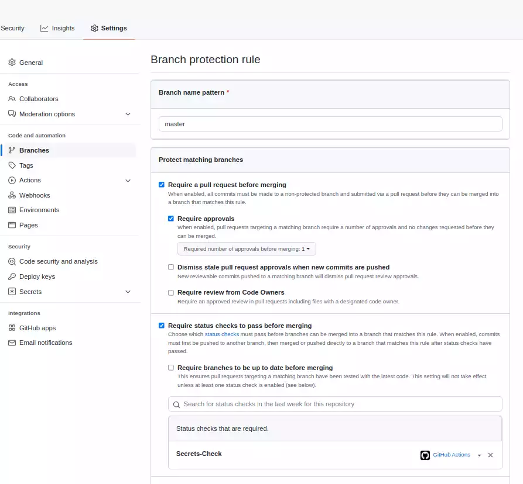
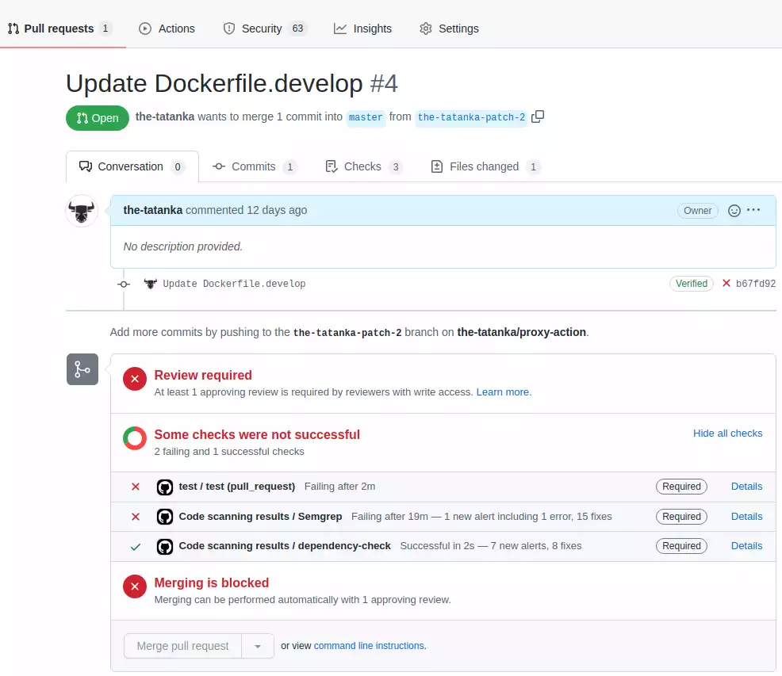

# GitHub Integration

Basic understanding of GitHub and GitHub Actions is necessary.

## GitHub Limitation and Solution

TODO Vendor Lock-In ...

- SARIF dashboard is expensive!

- Use backlog or issue board as dashboard

- One issue equals one security finding

- Stick to the SARIF standard

  - Much easier integration of future tools

- Use issue tags like _security_ to filter issues and separate them from the other issues

- Using the findings as issues makes it easier to integrate the mitigation into their dev workflow

- Create one GitHub Action that exports findings to the used issue board (Jira, GitHub, ...)

  - Auto create and close issues

  - Use SARIF values to create meaningful issues

  - Check for duplicates - use some sort of ID to track duplicates

## Workflow Strategy

```mermaid
graph TD
    A[Feature] -->|Pull request| B{Pull request <br /> -status checks?}

    B -->|&#9745 <br /> Merge pull request / push| C[Staging <br /> -deploy to staging env]
    B -->|&#9746 <br /> Make changes| A

    C -->|Pulll request| D{Pull request <br /> -status checks?}
    D -->|&#9745 <br /> Merge pull request / push| E[Main <br /> -create a release <br /> -deploy to prod env]
    D -->|&#9746 <br /> Make changes| C
```

## Branch Protection Rules

The main / master branch must be blocked. You are only allowed to commit to them if all security **status checks** of the actions are successful.



The actions can be configured to run for each pull request.

This ensures that all security status checks are checked before the release of the main/master branch takes place.



## Pre-Commit Hooks

Catch bugs or vulnerabilities before they get into the repo.

Steps:

- Check for secrets

- Quality checks: code formatting, commit messages

One way to use git hooks locally in a Node environment is by using a library called husky. Install husky as dev-dependency.

Put these lines of code into your package.json.

```json
"husky": {
    "hooks": {
      "pre-commit": "gitleaks detect -v -s ./src/ --no-git -c gitleaks.toml"
    }
  },
```

It may happen that the hooks do not work - two solutions:

- Remove node_modules and then install the packages again

- Remove the git hooks folder, uninstall husky and install it again

## Upload Build Artifacts

GitHub provides a default action for uploading artifacts.

```yml
build:
  runs-on: ubuntu-latest
  steps:
    - name: Build Projects
      if: github.event_name == 'push'
      run: npm run build

    - name: Upload Build Folder
      if: github.event_name == 'push'
      uses: actions/upload-artifact@v1
      with:
        name: build
        path: build
```

## Release Management

You can create a GitHub release to package software, along with release notes and links to workflow artifacts.

Official github documentation:

- https://docs.github.com/en/repositories/releasing-projects-on-github/about-releases

**semantic-release** automates the whole package release workflow including: determining the next version number, generating the release notes, and publishing the package.

- https://github.com/semantic-release/semantic-release

semantic-release uses the commit messages to determine the consumer impact of changes in the codebase. Following formalized conventions for commit messages, semantic-release automatically determines the next semantic version number, generates a changelog and publishes the release.

By default, semantic-release uses Angular Commit Message Conventions.

Tools such as commitizen or commitlint can be used to help contributors and enforce valid commit messages.

The commit messages are checked for quality. The quality guidelines are determined by https://www.conventionalcommits.org/.

With the devDependency packages **commitlint/cli** and **commitlint/config-conventional** enforce the quality.

The Commitizen tool is used to create quality commit messages. Commitizen must be installed locally:

- https://github.com/commitizen/cz-cli

- npm install commitizen -g

- Initialize project to use the cz-conventional-changelog: commitizen init cz-conventional-changelog --save-dev --save-exact
