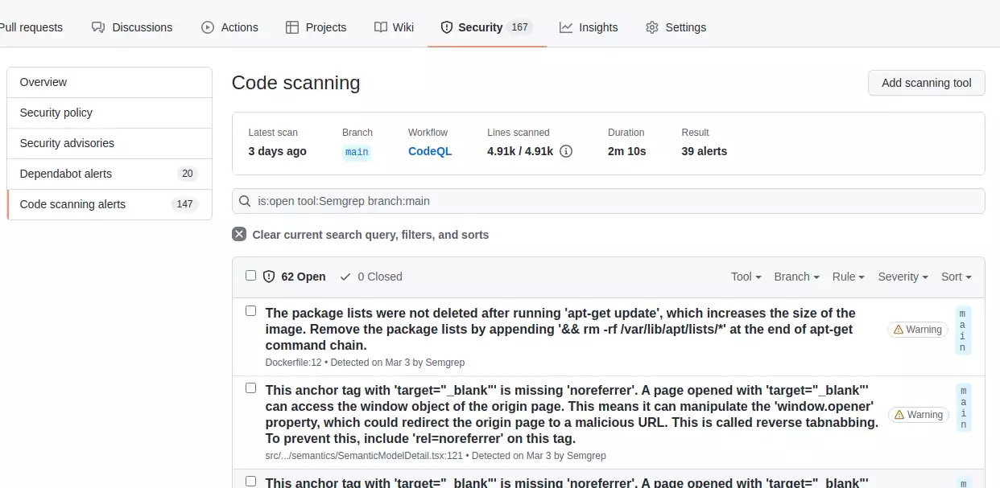

# Intro

The **Software Development Life Cycle (SDLC)** is a structured process that enables the production of high-quality, low-cost software, in the shortest possible production time. The SDLC defines and outlines a detailed plan with stages, or phases, that each encompass their own process and deliverables.

The role of security in the SDLC - integrating security activities throughout the SDLC helps create more reliable software. By incorporating security practices and measures into the earlier phases of the SDLC, vulnerabilities are discovered and mitigated earlier, thereby minimizing overall time involved, and reducing costly fixes later in the life cycle.

With modern application security testing tools, it is easy to integrate security throughout the SDLC. In keeping with the **secure SDLC** concept, it is vital that security assurance activities such as penetration testing, threat modeling, code review, and architecture analysis are an integral part of development efforts. **A pipeline is essential for automating** these tools.

The primary **advantages of pursuing a secure SDLC approach** include:

- Security as a continuous concern

- Awareness of security considerations by stakeholders

- Early detection of flaws in the system

- Cost reduction as a result of early detection and resolution of issues

- Overall reduction of intrinsic business risks for the organization

## What are the SDLC models/methodologies?

Waterfall, Agile, Lean, Iterative, Spiral, V-Shaped.

More or less, all models include these phases: Planning, Coding, Building, Testing, Release, Deploy, Operate, Monitor.

## Secure SDLC best practices

### Planning

- **Threat Modeling** - Bring your application design weaknesses to light by exploring potential hacker exploits. Spot design flaws that traditional testing methods and code reviews might overlook.

### Coding

- **Pre-Commit Hooks** - Prevent you from committing sensitive information like credentials into your code management platform.

- **Peer reviews** - Protect the master/main branch and perform peer reviews through the pull requests.

- **IDE Security plugins** - Are not worth the trouble (my opinion).

### Building & Testing

- **Upload build artifact** - If security vulnerabilities enter production, it must be possible to trace where the error originated. And so that rollbacks can be carried out.

- **Static Application Security Testing (SAST)** - Analyze source code to find security vulnerabilities that make your organization’s applications susceptible to attack. Address security and quality defects in code while it is being developed, helping you accelerate development an increase overall security and quality.

- **Software Composition Analysis (SCA)** - Secure and manage open source risks in applications and containers. Manage security, quality, and license compliance risk that comes from the use of open source and third-party code in applications and containers.

- **Secret scanning** - If your project communicates with an external service, you might use a token or private key for authentication. Tokens and private keys are examples of secrets that a service provider can issue. If you check a secret into a repository, anyone who has read access to the repository can use the secret to access the external service with your privileges. Secret scanning will scan your entire Git history on all branches present in your repository for secrets. Run the secret scanning as a pre-commit hook to prevent the secrets from entering the repository.

### Release & Deploy

- **Infrastructure as Code (IaC) Scanning** - Also known as software-defined infrastructure, allows the configuration and deployment of infrastructure components faster with consistency by allowing them to be defined as a code and also enables repeatable deployments across environments.

- **Release management** - Move software builds through the various phases quicker and more frequently. Build, deploy and secure your releases through configuration management - define a release strategy.

### Operate

- **Dynamic Application Security Testing (DAST)** - Dynamic analysis evaluates an application while executing it to uncover issues with its runtime behavior.

- **Fuzzing** - Identify defects and zero-day vulnerabilities in services and protocols. Use black box fuzzer to efficiently and effectively discover and remediate security weaknesses in software. Web API fuzzing performs fuzz testing of API operation parameters. Fuzz testing sets operation parameters to unexpected values in an effort to cause unexpected behavior and errors in the API backend. This helps you discover bugs and potential security issues that other QA processes may miss.

- **Penetration Testing** - Penetration testing analysis helps you find and fix exploitable vulnerabilities in your server-side applications and APIs. Reduce your risk of a breach by identifying and exploiting business-critical vulnerabilities, before hackers do.

### Monitor

Not my area of expertise.

- Log collection

- Rollback

## Example security toolchain

The following sections present a collection of **GitHub Actions**.

Depending on how the development project is structured, other actions or tools may have to be used.

The shown actions are suitable for a JavaScript project, for example React.js with npm.

The presented tools are all open source and free of charge.

This example uses Github Advanced Security Features. These features are enabled for all public repositories or by purchasing a Github Advanced Security license (=> Github Enterprise license).

The GitHub Advanced Security Features do not have to be used (remove the upload SARIF step).

However, the use of the Advanced Security Features is recommended in order to use the GitHub Advanced Security Dashboard / SARIF. The results of allmost all used tools can be displayed in this dashboard. So there is no need to use separate reports or web UIs to see the findings. This has the consequence that the overhead is extremely reduced and the developer friendliness is increased, which in turn leads to more security.

In this section there is a subsection for each secure SDLC best practice.
